

  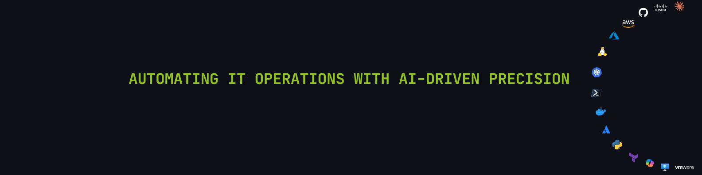

<h2 align="center">Muhammad Hammad · IT Infrastructure Engineer</h2>

  Cloud infrastructure (Azure / AWS) · DevOps &amp; automation · Network engineering · Systems administration 
  Göttingen, Germany · IT engineering since 2019 · M.Sc. Data Science, University of Göttingen

  
  
  

  

## What I do

I keep infrastructure boring, meaning secure, observable and automated, so the
people who depend on it never have to think about it. I work across the whole
stack: identity (Active Directory, Entra ID, Okta), endpoints (Intune, Autopilot, Jamf),
networks (Cisco, Juniper, pfSense, VPN), cloud (Azure, AWS) and the service
desk on top. The repetitive parts become code: PowerShell, Python, Terraform and pipelines.

  

## Featured work

<table>
  <tr>
    <td width="50%"><a href="https://github.com/Muhammadhammad24/aws-terraform-platform">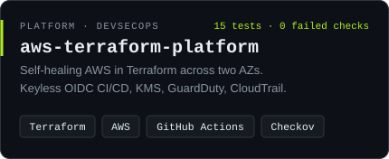</a></td>
    <td width="50%"><a href="https://github.com/Muhammadhammad24/Infotech-Wizard">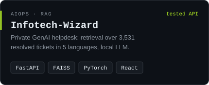</a></td>
  </tr>
  <tr>
    <td width="50%"><a href="https://github.com/Muhammadhammad24/pfSense-Firewall-Lab"></a></td>
    <td width="50%"><a href="https://www.nova2labs.com">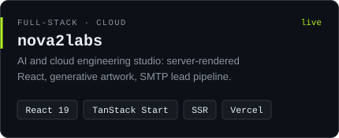</a></td>
  </tr>
  <tr>
    <td width="50%"><a href="https://github.com/Muhammadhammad24/velqatechnologies"></a></td>
    <td width="50%"><a href="https://github.com/Muhammadhammad24/nnapprox">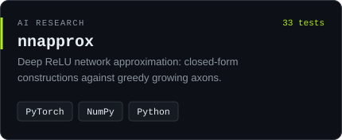</a></td>
  </tr>
</table>

Every public repository is tested in CI, and each README states what exists and what is on the roadmap. More work at [muhammadhammad.vercel.app](https://muhammadhammad.vercel.app).

## Toolbox

<picture>
  <source media="(prefers-color-scheme: dark)" srcset="assets/brands-dark.svg"/>
  <source media="(prefers-color-scheme: light)" srcset="assets/brands-light.svg"/>
  
</picture>

## Career

  

## Certifications

  

<table>
  <tr><td colspan="2"></td></tr>
  <tr><td width="50%"><a href="https://www.coursera.org/account/accomplishments/verify/29N5ZLK6BVWW"></a></td><td width="50%"><a href="https://www.open.edu/openlearn/digital-computing/discovering-computer-networks-hands-on-the-open-networking-lab/content-section-overview"></a></td></tr>
  <tr><td width="50%"><a href="https://www.udemy.com/certificate/UC-7c6ee425-74e1-489d-908c-d0b201c4ff3c/"></a></td><td width="50%"><a href="https://www.open.edu/openlearn/digital-computing/successful-it-systems/content-section-0"></a></td></tr>
  <tr><td colspan="2"></td></tr>
  <tr><td width="50%"><a href="https://www.coursera.org/account/accomplishments/verify/74NSF2JALFZV"></a></td><td width="50%"><a href="https://www.udemy.com/certificate/UC-0b67e267-2b09-40d7-a980-d2f5b62876fe/"></a></td></tr>
  <tr><td width="50%"><a href="https://www.open.edu/openlearn/digital-computing/the-database-development-life-cycle/content-section-0"></a></td><td width="50%"><a href="https://www.udemy.com/certificate/UC-be70fe74-aa67-4e6c-afad-5cacc8d371ae/"></a></td></tr>
  <tr><td colspan="2"></td></tr>
  <tr><td width="50%"><a href="https://www.udemy.com/certificate/UC-b72e7563-4360-4d02-abf9-47bf7b9dc046/"></a></td><td width="50%"><a href="https://www.udemy.com/certificate/UC-b6509a21-528b-43bf-b0ae-f7458612d212/"></a></td></tr>
  <tr><td width="50%"><a href="https://www.udemy.com/certificate/UC-4c5d2d2a-dade-4cee-a7c4-0fd2ad689c90/"></a></td><td width="50%"><a href="https://www.open.edu/openlearn/science-maths-technology/mathematics-statistics/exploring-data-graphs-and-numerical-summaries/content-section-0"></a></td></tr>
  <tr><td colspan="2"></td></tr>
</table>

---

  <b>Open to IT infrastructure, cloud and DevOps roles worldwide</b>, remote or on-site, and happy to relocate. 
  English (C1) · German (B1) · <a href="mailto:muhammad24997@gmail.com">muhammad24997@gmail.com</a>

