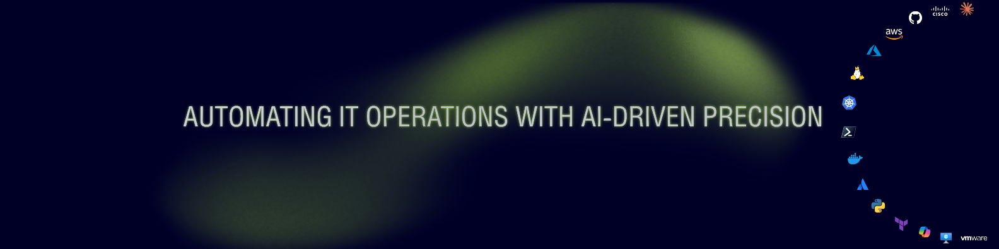
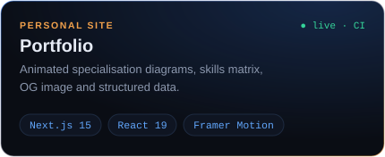

  

<h2 align="center">Muhammad Hammad · IT Infrastructure Engineer</h2>

  Cloud infrastructure (Azure / AWS) · DevOps &amp; automation · Network engineering · Systems administration 
  Göttingen, Germany · IT engineering since 2019 · M.Sc. Data Science, University of Göttingen

  
  
  

  

## What I do

I keep infrastructure boring, meaning secure, observable and automated, so the
people who depend on it never have to think about it. I work across the whole
stack: identity (Active Directory, Entra ID, Okta), endpoints (Intune, Autopilot, Jamf),
networks (Cisco, Juniper, pfSense, VPN), cloud (Azure, AWS) and the service
desk on top. The repetitive parts become code: PowerShell, Python, Terraform and pipelines.

**Selected impact**

| | Outcome | Where |
| --- | --- | --- |
| ⚙️ | **25 hours a week** of onboarding, provisioning and patching automated (PowerShell, Python, Power Automate) | Kontinental Establishment |
| 💻 | **75% faster** device setup for 180+ macOS, Windows and iOS endpoints across 12 locations (Intune, Autopilot, Jamf) | Kontinental Establishment |
| 🚀 | **4 hours → 35 minutes** deployment time for ML infrastructure with Docker and CI/CD | University of Göttingen |
| 🛡️ | **85% fewer vulnerabilities** through automated security scanning and pre-commit gates | University of Göttingen |
| 🏛️ | **265+ government endpoints** at 100% patch compliance; provisioning cut from 2 h to 20 min | KTDMC |

## Featured work

<table>
  <tr>
    <td width="50%"></td>
    <td width="50%"></td>
  </tr>
  <tr>
    <td width="50%"></td>
    <td width="50%"></td>
  </tr>
  <tr>
    <td width="50%"></td>
    <td width="50%"></td>
  </tr>
</table>

Every repository is tested in CI, and every README states what exists and what is on the roadmap.

## Toolbox

  <b>Cloud &amp; IaC</b> 
  

  <b>Systems &amp; scripting</b> 
  

  <b>Delivery &amp; observability</b> 
  

  <b>Identity, endpoints &amp; networks</b> 
  
  
  
  
  
  
  
  
  
  
  

## Career

  

## Certifications

| Credential | Issuer | Verify |
| --- | --- | --- |
| System Administration and IT Infrastructure Services | Google · Coursera, 2025 | [coursera.org/verify/29N5ZLK6BVWW](https://coursera.org/verify/29N5ZLK6BVWW) |
| Full Stack Software Developer Assessment | IBM · Coursera, 2023 | [coursera.org/verify/74NSF2JALFZV](https://coursera.org/verify/74NSF2JALFZV) |
| Discovering Computer Networks: hands-on in the Open Networking Lab | The Open University, 2023 | Statement of participation |
| Successful IT Systems | The Open University, 2023 | Statement of participation |
| Information Security Basics for IT Support Technicians | Udemy, 2022 | Certificate of completion |

Also 20+ completed courses in Python, data science, machine learning, SQL and software development.

---

  Open to IT infrastructure, cloud and DevOps roles in Germany and remote · English (C1) · German (B1, improving)

